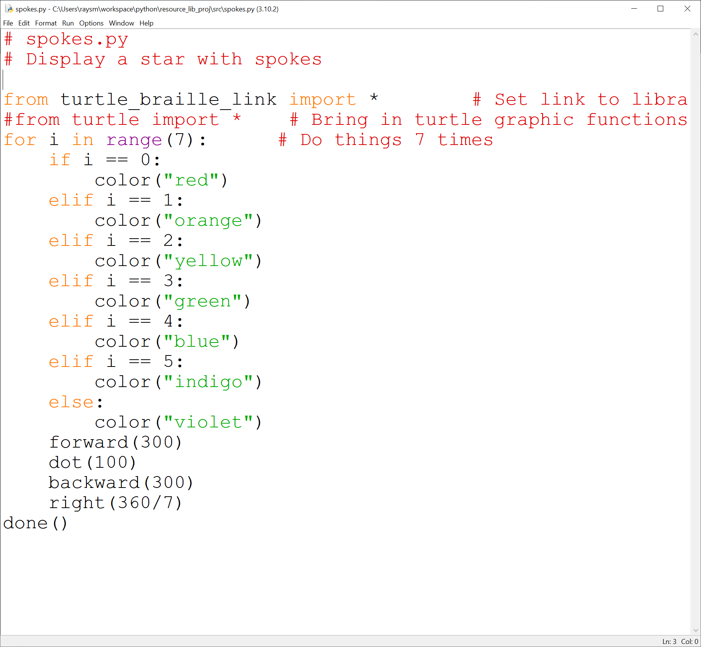
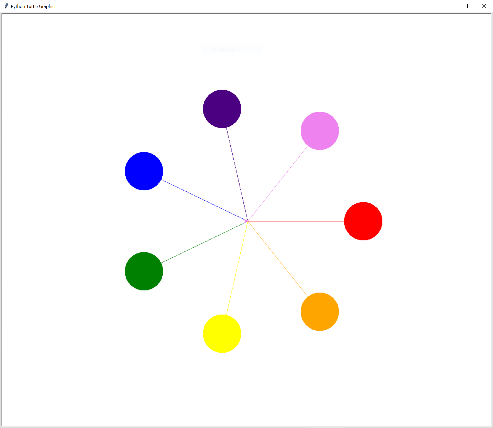
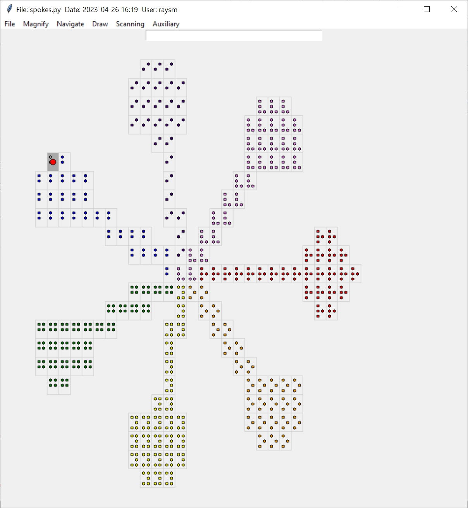
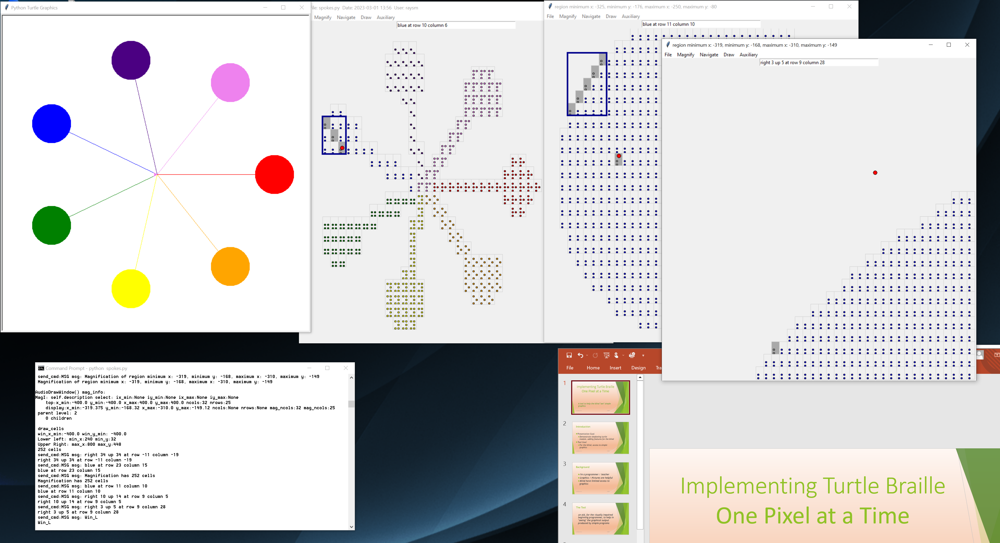
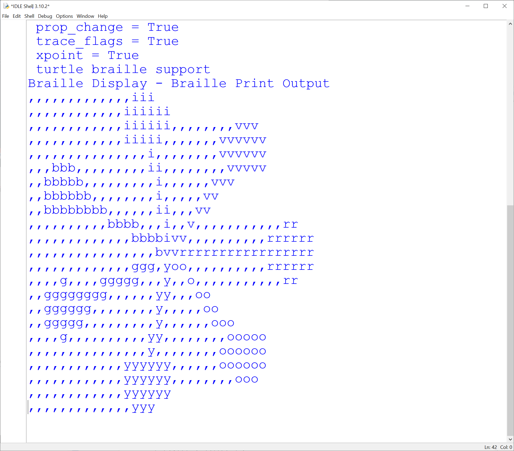

# Turtle Braille
#### Added to resource_lib because we thought it might become part of our basic general support
We attempt to enable blind individuals to "visualize" simple graphics produced by Python's turtle module.
Our approach is to capture program control at the execution end and then scan the tkinter Canvas which is created.  In addition to turtle's standard graphics window, the following additions are created:
* A "text picture" suitable for a low resolution physical display.
This "text picture" is also placed in the Window clipboard to aid in placing the picture in the embosser program
* A audio-draw-window which displays the expected braille - lower resolution(e.g. 40 x 25 braille cell) rendition of the turtle display
* The audio-draw-window supports many keyboard window positioning options, which give audio feedback of the current cursor position. The audio feedback user controlled - spoken text or audio tones.
* The audio-draw-window supports the production of additional windows presenting magnifications of window selections.  

## Turtle Braille setup from GitHub
* Create braille_xxxx e.g. on Desktop
* copy raysmith619/resource_lib/src to braille_xxxx/resource_lib_proj
* pip install pysinewave for pitch utilities
* pip install pyttsx3 for speech support
* pip install sounddevice for tones
* run braille_xxxx/resource_lib_proj/square_loop_colors.py as an example  
## Notable text picture modifications
These changes were the results of experiences with and comments from some 8th grade students at the Perkins School for the Blind.

- Non-trailing blanks are replaced with "," characters so as not to be compressed by the braille producing software.  The ","
characters, while not being "blank" are single dot braille constructs, and are empty view.
- Blank area above and to the left is removed to facilitate viewers finding graphics objects.

## A set of screen shots for a simple program
### Example User program in IDLE

# turtle display window

# turtle display window - audio feedback
Note that the color of the braille dots is for the implementer's view to empasize the color.
Also the rectangles surrounding the dots are to further help the visual image.
### Braille Window - audio feedback - An implementation aid, providing the likely braille view


Keyboard / Menu commands
## Keyboard display/positioning commands
```
        h - say this help message
        Up - Move up through run of same color/space
        Down - Move down through run of same color/space
        Left - Move left through run of same color/space
        Right - Move right through run of same color/space
        DIGIT - Move one square in direction (from current square):
           7-up left    8-up       9-up right
           4-left       5-mark     6-right
           1-down left  2-down     3-down right
              0-erase
        a - move to first(Left if Horizontal, Top if Vertical)
        b - move to second(Right if Horizontal, Bottom if Vertical)
        c<roygbiv> - set color red, orange, ...
        d - pendown - mark when we move
                
        g - Go to closest figure
        j - jump up to reduced magnification
        k - jump down to magnified region
        m - mark location
        p - Report/Say current position
        r - Horizontal position stuff to left, to Right
        t - Vertical position stuff to Top, to bottom
        u - penup - move with out marking 
        w - write out braille
        x - move to original cell (after a/b Horizontal/Vertical)
        z - clear board
        Escape - flush pending report output
```        
## File - Program control - Only Exit is functioning
```
        x - Exit program
```

## Magnify - Magnification Control
```
        Help - list magnify commands (Alt-m) commands
        h - say this help message
        t - expand magnify selected region left/right
        s - select/mark magnify region
        t - expand magnify selected region up/down top/bottom
        v - view region (make new window)
```
### Magnify supports the creation of a new audio-display-window, enlarging the currently selected region of the current audio-display-window.  The selected region is the rectangular region encompasing the currently traversed squares.
###Currently options t is not implemented.



## Navigate - Navigation commands from Navigate pulldown menu
```
        Help - list navigate commands (Alt-n) commands
        h - say this help message
        a - Start reporting position
        b - remove 
        z - stop reporting position
        e - echo input on
        o - echo off
        v - visible cells
        i - invisible cells
        r - redraw figure
        s - silent speech
        t - talking speech
        l - log speech
        m - show marked(even if invisible)
        n - no log speech
        p - report position
        u - audio beep
        d - no audio beep
         Escape - flush pending report output
```

## Draw - Free drawing control
```
        Help - list drawing setup commands (Alt-d) commands
        h - say this help message
        d - Start/enable drawing
        s - stop/disable drawing
        Escape - flush pending report output
```

### Scanning - Audio Window Scanning
```
        Help - list scanning commands (Alt-s) commands
        h - say this help message
        c - combine wave - faster scan
        d - disable combine wave - viewing in window
        k - toggle skip space
        s - Start scanning mode
        t - Stop scanning mode
        n - no_item_wait
        w - wait for items
```

## Auxiliary  - internal tracking / debugging
```
        Trace - tracing control
```
### Program text printout - targeted for the brailler machine



## Supported turtle commands
Because of our post running, screen scanning technique, we support all turtle commands, not requiring animation.  That is, we take a static snapshot at the end of the program.


Our implementation has some harsh compromises:
- Our graphics resolution is currently 40 wide by 25 down for a 800 by 800 screen.  Note this is further constrained by the fact that our students' shared braille embosser is set to 30 characters wide.
- Colors are represented by braille for the color's first letter(English)
- No motion - yet

## TurtleBraille Support Files
- turtle_braille.py - direct outer interface to global turtle commands, and turtle object level commands
- braille_display.py - implements turtle commands in the braille setting and the creation of display braille window and text printout
- turtle_braille_link.py - simple link to support user level replacement of "from turtle import *" with "from turtle_braille_link import *" lines
### TurtleBraille Trace / logging support
-    select_trace.py
-    crs_funs.py
-    select_error.py
-    select_report.py
-    java_properties.py

# resource_lib
## Common files / support for other projects
Contains files used to support other projects.
Provides logging, tracing, properties support.


## Brief listing of document files (Docs directory)
- Program_Logging_Tracing.pptx PowerPoint presentation about Logging/Tracing demonstrating the classes SlTrace and TraceControlWindow
## Brief listing of source files (src directory) with purpose.
- arrange_control.py: window sizing/placement support
- java_properties.py: simple properties file support
- logging_absolute_minimum.py: smallest example of logging
- logging_tracing_menu.py: TraceControlWindow class example
- logging_tracing_simplest.py: Simple logging/tracing example
- resource_group.py: support to handle a program's resource groups
- select_control.py class SelectControl
  * Base for independent control
  * Provides a singleton which is universally accessible
  * Facilitates
     * setting and retrieving of game controls
     * persistent storage of values
- select_dd_choice.py Dropdown choice one of n text strings - not sure
- select_error.py General local, to our program/game, error class
- select_trace.py class SlTrace
  * trace/logging package
  * derived from smTrace.java (ours)
  * properties file support
- select_window.py  Program Level Menu control
- tkMath.py Useful window math thanks to: tkMath from recipe-552745-1.py  Ronald Longo
- trace_control_window.py class TraceControlWindow
  * Window support for SlTrace flag manipulation
- variable_control.py class VariableControlWindow
  * Simple Control and Display of program variables
  * Adapted from trace_control_window.py/TraceControl
  * Essentially presents a scrollable list of variable names and values
  * Uses select_control/SelectControl to store and manipulate variable contents
