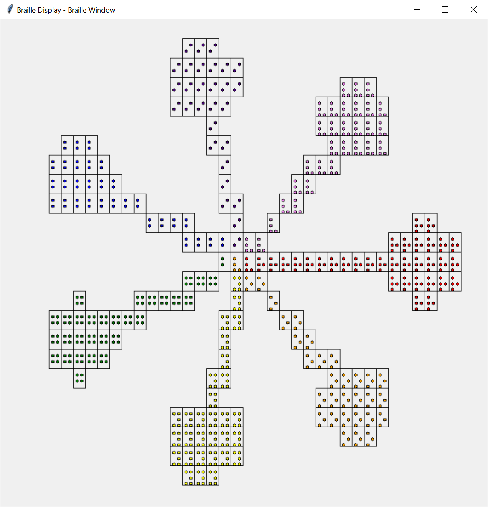
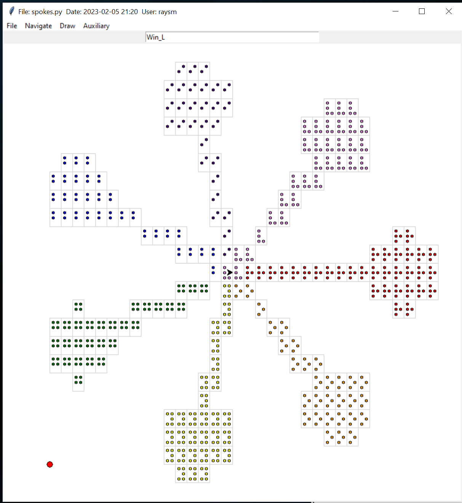

# Turtle Braille
#### Added to resource_lib because we thought it might become part of our basic general support
We attempt to provide simple support for the novice blind programmer.   What is provided is a simple subset of the python turtle command set.  Our programming
approach is to accept these turtle commands, passing them unmodified to turtle, but additionally producing the following:
* A braille window which displays the expected braille - lower resolution(e.g. 40 x 25 braille cell) rendition of the turtle display
* A text printout which, if directed to a brailler will produce a physical display similar to the braille window.  

## Some recent improvements
These changes were the results of experiences with and comments from some 8th grade students at the Perkins School for the Blind.

- Non-trailing blanks are replaced with "," characters so as not to be compressed by the braille producing software.  The ","
characters, while not being "blank" are single dot braille constructs, and are empty view.
- Blank area above and to the left is removed to facilitate viewers finding graphics objects.

## A set of screen shots for a simple program
# User program in IDLE

# turtle display window

# Braille Window - An implementation aid, providing the likely braille view
Note that the color of the braille dots is for the implementer's view to empasize the color.
Also the rectangles surrounding the dots are to further help the visual image.



# turtle display window - audio feedback

# Braille Window - audio feedback - An implementation aid, providing the likely braille view
## Keyboard display/positioning commands
```
        h - say this help message
        Up - Move up one row
        Down - Move down one row
        Left - Move left one column
        Right - Move right one column
        a - Start reporting location
        l - Start logging talk
        m - Stop logging talk
        s - Stop speech
        t - Start speech
        x - exit program
        z - Stop reporting location
        RETURN - Report location
```        


# Program text printout - targeted for the brailler machine


## Supported turtle commands
Note that we do not handle all turtle commands - mostly those which support simple static low resolution graphics.
def backward(length):
def color(*args):
def dot(size=None, *color):
def filling():
def begin_fill():
def end_fill():
def forward(length):
def goto(x, y=None):
def setpos(x, y=None): 
def setposition(x, y=None): 
def left(angle):
def pendown():
def penup():
def right(angle):
def speed(speed):
def mainloop():
def done():
def pensize(width=None):
def width(width=None):


Our implementation has some harsh compromises:
- Our graphics resolution is currently 40 wide by 25 down for a 800 by 800 screen.
- Colors are represented by braille for the color's first letter(English)
- No motion - yet

## TurtleBraille Support Files
- turtle_braille.py - direct outer interface to global turtle commands, and turtle object level commands
- braille_display.py - implements turtle commands in the braille setting and the creation of display braille window and text printout
- turtle_braille_link.py - simple link to support user level replacement of "from turtle import *" with "from turtle_braille_link import *" lines
### TurtleBraille Trace / logging support
-    select_trace.py
-    crs_funs.py
-    select_error.py
-    select_report.py
-    java_properties.py

# resource_lib
## Common files / support for other projects
Contains files used to support other projects.
Provides logging, tracing, properties support.


## Brief listing of document files (Docs directory)
- Program_Logging_Tracing.pptx PowerPoint presentation about Logging/Tracing demonstrating the classes SlTrace and TraceControlWindow
## Brief listing of source files (src directory) with purpose.
- arrange_control.py: window sizing/placement support
- java_properties.py: simple properties file support
- logging_absolute_minimum.py: smallest example of logging
- logging_tracing_menu.py: TraceControlWindow class example
- logging_tracing_simplest.py: Simple logging/tracing example
- resource_group.py: support to handle a program's resource groups
- select_control.py class SelectControl
  * Base for independent control
  * Provides a singleton which is universally accessible
  * Facilitates
     * setting and retrieving of game controls
     * persistent storage of values
- select_dd_choice.py Dropdown choice one of n text strings - not sure
- select_error.py General local, to our program/game, error class
- select_trace.py class SlTrace
  * trace/logging package
  * derived from smTrace.java (ours)
  * properties file support
- select_window.py  Program Level Menu control
- tkMath.py Useful window math thanks to: tkMath from recipe-552745-1.py  Ronald Longo
- trace_control_window.py class TraceControlWindow
  * Window support for SlTrace flag manipulation
- variable_control.py class VariableControlWindow
  * Simple Control and Display of program variables
  * Adapted from trace_control_window.py/TraceControl
  * Essentially presents a scrollable list of variable names and values
  * Uses select_control/SelectControl to store and manipulate variable contents
